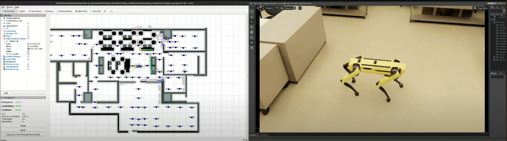

# IsaacSim_Routing

## Spot Robot Navigation with Isaac Sim and ROS 2

This repository contains setup and running instructions for Spot robot navigation simulation using NVIDIA Isaac Sim and ROS 2 Humble.

## Prerequisites

- NVIDIA Isaac Sim 4.2.0

- ROS 2 Humble

- Spot robot packages configured in your ROS 2 workspace

## Running the Simulation

### 1\. Launch Isaac Sim Spot Navigation

First, navigate to your Isaac Sim installation directory and run the Spot navigation example:

```bash
cd /home/bruce/.local/share/ov/pkg/isaac-sim-4.2.0 
./python.sh standalone_examples/api/omni.isaac.quadruped/spot_nav_standalone.py --env lab
```

### 2\. Launch ROS 2 Navigation Stack

In a new terminal, launch the navigation stack with RViz visualization:

```bash
cd /home/bruce/IsaacSim/IsaacSim-ros_workspaces/humble_ws
ros2 launch spot_config navigate.launch.py rviz:=true
```

### 3\. Start the Routing Server

Open another terminal and launch the routing server:

```bash
cd /home/bruce/IsaacSim/IsaacSim-ros_workspaces/humble_ws
ros2 launch routing_agent RunServer.launch.py 
```

### 4\. Run Waypoint Navigation

Finally, in a new terminal, start the waypoint navigation node:

```bash
cd /home/bruce/IsaacSim/IsaacSim-ros_workspaces/humble_ws
ros2 run spot_routing_nav waypoint_nav
```

## **Demo**
### City Science Lab Test Demo
<a href="https://www.youtube.com/embed/frTH0QERYtQ?si=7wk3lFImAGLvmFTA" title="Link Title"></a>


## Notes

- Make sure to run each command in a separate terminal

- The commands should be executed in the order listed above

- Verify that Isaac Sim is properly installed and configured before running the simulation

- Ensure all ROS 2 dependencies are installed in your workspace
